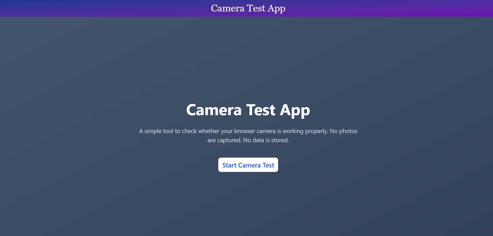
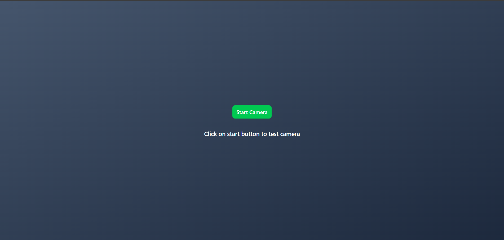
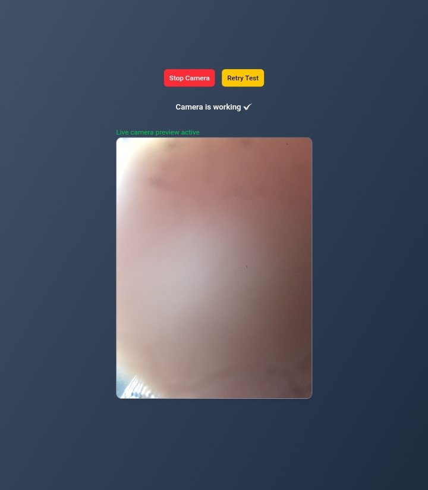
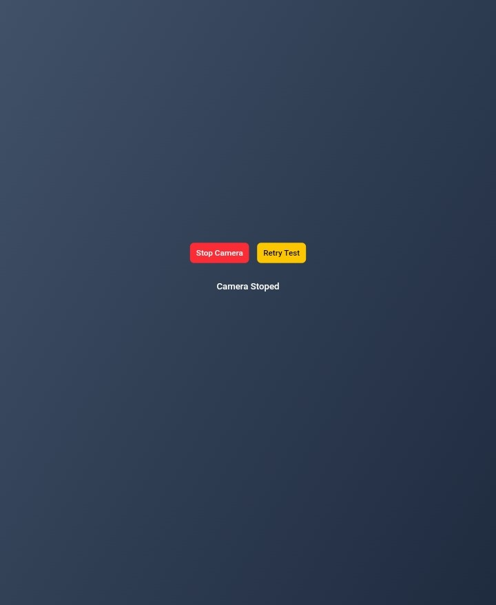

Perfect! Yahaan main **Version 2 ko GitHub-ready Markdown** me tayyar kar raha hoon, screenshots ke placeholders ke saath:

````markdown
# Camera Test App

A simple MERN frontend app to verify browser camera access and handle basic media streams.

---

## Setup

1. **Clone the repository:**
```bash
git clone https://github.com/06ayushyadav/task2.git
cd camera-test
````

2. **Install dependencies:**

```bash
npm install
```

3. **Run the development server:**

```bash
npm run dev
```

4. **Open in browser:**
   Navigate to [https://cameratestapp.netlify.app/] .

---

## Camera Test Explanation

This app checks browser camera functionality:

* **Request Camera Access:**
  On clicking the **Start Camera Test** button:

  ```javascript
  navigator.mediaDevices.getUserMedia({ video: true })
  ```

  * **Allowed:** Shows `Camera is working ✅` and live preview
  * **Denied/Error:** Displays an error message

* **Live Camera Preview:**
  Displays the live feed in a `<video>` element with the text:
  `Live camera preview active`

* **Stop / Retry:**

  * **Stop:** Releases media tracks, shows `Camera stopped`
  * **Retry:** Restarts the camera test

* **UX & Code Quality:**

  * Reusable button component
  * Proper cleanup on unmount
  * Start button disabled while requesting permission
  * Responsive layout for mobile devices

* **Browser Support:** Chrome, Edge

---

## Screenshots

### Homepage



### Camera Start button



### Live Camera Preview



### Camera Stopped / Retry



---

## Limitations

* Only supports basic camera preview; no photo capture or video recording.
* Minimal design; focus is on functionality.
* Optional bonus features (switch camera, show resolution) not implemented except loading spinner.

---

